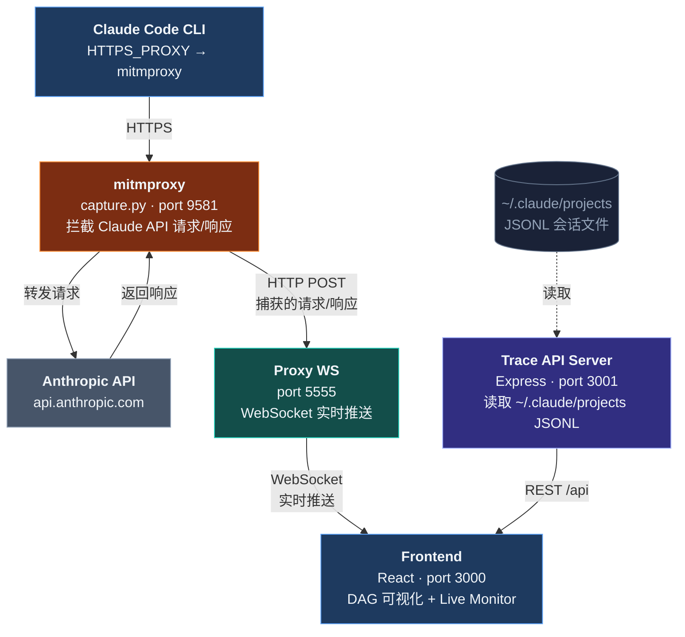

<p align="center">
  
  
  
  
  
</p>

<p align="right"><a href="./README_EN.md">English</a></p>

# Claude Devtools

> 可视化你的 Claude Code 会话历史 & 实时监控 API 流量

Claude Devtools 是一款面向 Claude Code 开发者的本地调试工具。它将 Claude Agent 的会话 trace 渲染为可交互的 DAG（有向无环图），同时通过 mitmproxy 拦截并展示实时 API 请求/响应，帮助开发者理解 Agent 的执行流程、调试 prompt 和优化 token 用量。

---

## 截图

### Session Traces — DAG 可视化


<table>
<tr><td><b>左侧边栏</b></td><td>浏览所有项目目录，展开查看会话列表（显示事件数、时间戳、子代理数量标记）</td></tr>
<tr><td><b>统计栏</b></td><td>顶部汇总当前会话的事件数、链数、分叉数，按类型细分（user / assistant / tool-call / subagent 等）</td></tr>
<tr><td><b>搜索</b></td><td>节点过滤搜索，快速定位目标事件</td></tr>
<tr><td><b>DAG 画布</b></td><td>交互式有向图，按时间轴纵向排列，节点按类型着色：<span style="color:#60a5fa">USER</span> / <span style="color:#4ade80">ASSISTANT</span> / <span style="color:#fb923c">TOOL</span> / <span style="color:#2dd4bf">TASK</span>；task 节点右分支展示子代理链</td></tr>
<tr><td><b>折叠链</b></td><td>线性无分支事件自动折叠为单个节点，显示事件数及类型标签，点击在侧面板展开</td></tr>
</table>

### Live Monitor — 请求参数结构化解析


<table>
<tr><td><b>连接状态</b></td><td>顶部显示 WebSocket 连接状态与请求计数</td></tr>
<tr><td><b>会话过滤</b></td><td>按会话 ID 切换不同 Claude Code 实例的请求流</td></tr>
<tr><td><b>Token 统计</b></td><td>实时汇总 output / input / cache_read / cache_creation token 数量及总费用</td></tr>
<tr><td><b>请求列表</b></td><td>左侧按时间排列每次 API 调用，显示模型、消息数、工具数、状态码</td></tr>
<tr><td><b>结构化解析</b></td><td>右侧将请求体拆解为语义化模块：model、对话记录（user/assistant 配对）、system 提示块、tools 定义、metadata、max_tokens、temperature、stream 等，每项可折叠展开</td></tr>
</table>

### Live Monitor — 对话轮次展开


<table>
<tr><td><b>对话轮次</b></td><td>展开「对话记录」可查看每一轮 user/assistant 交互的完整内容</td></tr>
<tr><td><b>内容块分类</b></td><td>每轮对话按 content block 拆分：text（文本回复）、tool_use（工具调用及参数）、tool_result（工具返回结果）、thinking（思考过程）</td></tr>
<tr><td><b>代码高亮</b></td><td>tool_use 参数以代码格式展示，便于审查 Agent 实际发出的 Bash 命令、文件编辑等操作</td></tr>
</table>

---

## 核心功能

| 功能 | 说明 |
|------|------|
| **DAG 可视化** | 将会话事件渲染为有向图，节点类型包括 USER / ASSISTANT / TOOL / TASK / HOOK / SUBAGENT |
| **子代理分支** | Task 节点右分支，subagent 链在并行列中运行，清晰展示多代理协作关系 |
| **时间轴布局** | 纵轴按时间戳排列，并行链对齐，顺序段紧凑排列 |
| **链折叠** | 线性无分支节点自动折叠，点击在侧面板中展开详情 |
| **事件详情面板** | 点击任意节点查看 metadata、content blocks、thinking、tool 输入/结果、原始 YAML/JSON |
| **会话浏览器** | 侧栏列出所有项目和会话，显示事件数、时间戳、子代理标记 |
| **实时流量监控** | 通过 mitmproxy 捕获 Claude Code CLI 每一次 API 调用，WebSocket 实时推送至浏览器 |
| **请求结构化解析** | 将 API 请求体拆解为 model / messages / system / tools / metadata 等语义模块 |
| **对话轮次回放** | 展开查看每轮 user-assistant 对话的完整内容、工具调用参数与返回结果 |
| **Token 实时统计** | 汇总 output / input / cache_read / cache_creation token 数量及累计费用 |

---

## 快速开始

### 前置条件

- **Node.js** >= 18
- **yarn** 或 **npm**
- **Python 3** + [mitmproxy](https://mitmproxy.org/)（Live Monitor 功能需要）
- **Claude Code CLI**（`claude` 命令可用）

### 安装

```bash
git clone https://github.com/anthropics/claude-devtools.git
cd claude-devtools
yarn install
```

### 一键启动

推荐使用一键启动脚本，自动启动所有服务并设置环境变量：

**Windows (PowerShell)**
```powershell
.\start-devtools.ps1
```

**macOS / Linux**
```bash
chmod +x start-devtools.sh
./start-devtools.sh
```

脚本会依次启动以下服务，然后在当前终端打开 Claude CLI：

| 服务 | 地址 | 说明 |
|------|------|------|
| Frontend | http://localhost:3000 | Devtools Web 界面 |
| Trace API | http://localhost:3001 | 会话 trace 读取 API |
| Proxy | http://localhost:5555 | WebSocket 实时推送服务 |
| mitmproxy | http://localhost:9581 | HTTPS 流量拦截代理 |

### 手动启动

如果只需要 Session Traces 功能（不需要实时监控）：

```bash
yarn dev
```

如果需要实时监控，额外启动 mitmproxy 并设置环境变量：

```bash
# 终端 1 — 启动所有开发服务（含 mitmproxy）
yarn dev

# 终端 2 — 设置环境变量后启动 Claude CLI
# macOS / Linux
export HTTPS_PROXY="http://127.0.0.1:9581"
export NODE_TLS_REJECT_UNAUTHORIZED="0"
export CLAUDE_CODE_ATTRIBUTION_HEADER="0"
export CLAUDE_CODE_DISABLE_NONESSENTIAL_TRAFFIC="1"
claude
```

**Windows (PowerShell)** — 在任意 PowerShell 窗口中执行：

```powershell
$env:HTTPS_PROXY="http://127.0.0.1:9581"
$env:NODE_TLS_REJECT_UNAUTHORIZED="0"
$env:CLAUDE_CODE_ATTRIBUTION_HEADER="0"
$env:CLAUDE_CODE_DISABLE_NONESSENTIAL_TRAFFIC="1"
claude
```

---

## 配置

### Trace 目录

默认从 `~/.claude/projects` 读取会话 trace 文件。可通过环境变量覆盖：

```bash
TRACES_DIR=/path/to/projects yarn dev
```

或直接运行服务端：

```bash
node --import tsx/esm server/index.ts /path/to/projects
```

每个项目是一个子目录，包含 `.jsonl` 会话文件。子代理 trace 位于 `<project>/<sessionId>/subagents/<agentId>.jsonl`。

### npm 脚本

| 命令 | 说明 |
|------|------|
| `yarn dev` | 启动全部服务（frontend + trace API + proxy + capture） |
| `yarn client` | 仅启动前端（Vite dev server） |
| `yarn server` | 仅启动 trace API server |
| `yarn proxy` | 仅启动 WebSocket 代理服务 |
| `yarn capture` | 仅启动 mitmproxy 捕获脚本 |
| `yarn build` | 生产构建（Vite + tsc） |

---

## 架构



---

## 技术栈

| 层 | 技术 |
|---|---|
| **前端** | React 18, @xyflow/react v12, Tailwind CSS 4, TypeScript |
| **布局算法** | 自定义时间戳 + 泳道布局，dagre 辅助 |
| **后端** | Express 4, WebSocket (ws), 逐行读取 JSONL |
| **流量捕获** | mitmproxy (Python), capture.py addon |
| **构建** | Vite 5, tsx, concurrently |

---

## License

MIT
