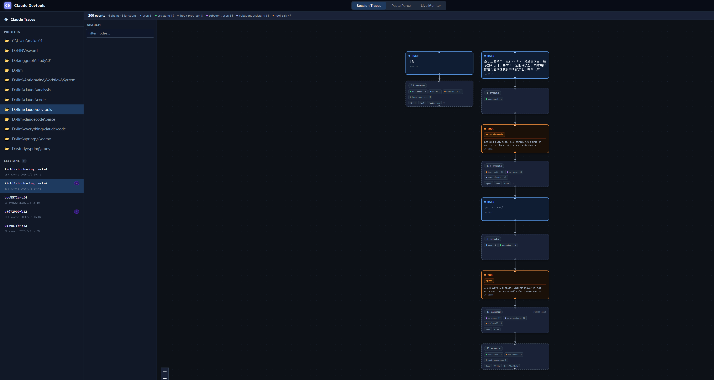
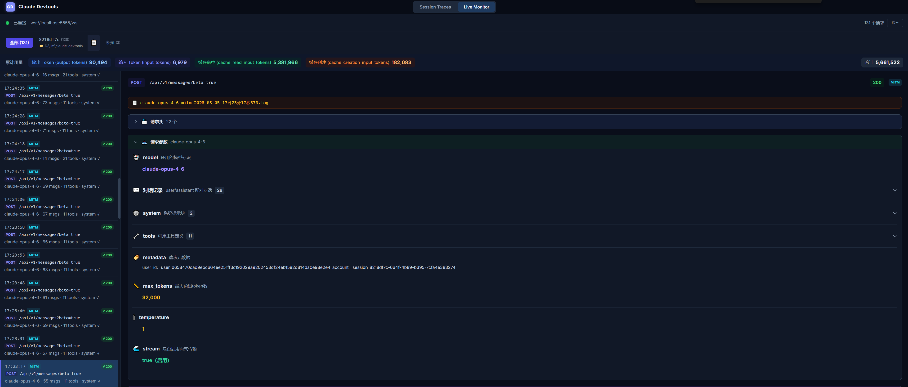
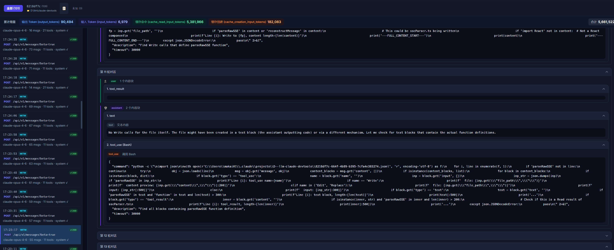
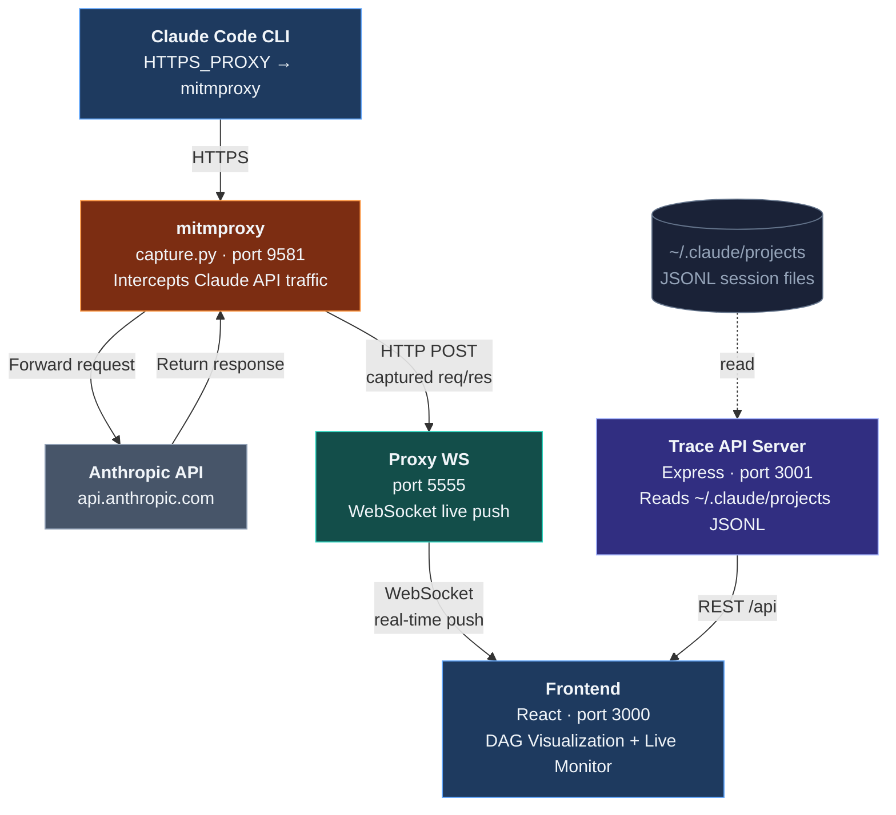

<p align="center">
  
  
  
  
  
</p>

<p align="right"><a href="./README.md">中文</a></p>

# Claude Devtools

> Visualize your Claude Code session history & monitor API traffic in real time

Claude Devtools is a local debugging tool for Claude Code developers. It renders Claude Agent session traces as interactive DAGs (Directed Acyclic Graphs) and captures real-time API requests/responses via mitmproxy, helping developers understand Agent execution flows, debug prompts, and optimize token usage.

---

## Screenshots

### Session Traces — DAG Visualization



<table>
<tr><td><b>Sidebar</b></td><td>Browse all project directories, expand to see session lists with event counts, timestamps, and subagent badges</td></tr>
<tr><td><b>Stats Bar</b></td><td>Top bar summarizes events, chains, junctions for the current session, broken down by type (user / assistant / tool-call / subagent, etc.)</td></tr>
<tr><td><b>Search</b></td><td>Filter nodes to quickly locate target events</td></tr>
<tr><td><b>DAG Canvas</b></td><td>Interactive directed graph laid out vertically by timestamp, nodes color-coded by type: USER (blue) / ASSISTANT (green) / TOOL (orange) / TASK (teal); task nodes branch right to show subagent chains</td></tr>
<tr><td><b>Collapsed Chains</b></td><td>Linear non-branching events auto-collapse into a single node showing event count and type labels; click to expand in a side panel</td></tr>
</table>

### Live Monitor — Structured Request Parsing



<table>
<tr><td><b>Connection Status</b></td><td>Top bar shows WebSocket connection state and request count</td></tr>
<tr><td><b>Session Filter</b></td><td>Switch between request streams from different Claude Code instances by session ID</td></tr>
<tr><td><b>Token Stats</b></td><td>Real-time aggregation of output / input / cache_read / cache_creation tokens and total cost</td></tr>
<tr><td><b>Request List</b></td><td>Left panel lists each API call chronologically, showing model, message count, tool count, and status code</td></tr>
<tr><td><b>Structured Parsing</b></td><td>Right panel breaks down the request body into semantic modules: model, conversation turns (user/assistant pairs), system prompt blocks, tool definitions, metadata, max_tokens, temperature, stream — each collapsible</td></tr>
</table>

### Live Monitor — Conversation Turn Expansion



<table>
<tr><td><b>Conversation Turns</b></td><td>Expand "conversation history" to inspect the full content of each user/assistant exchange</td></tr>
<tr><td><b>Content Block Types</b></td><td>Each turn is split by content block: text (text reply), tool_use (tool call with arguments), tool_result (tool return value), thinking (reasoning process)</td></tr>
<tr><td><b>Code Display</b></td><td>tool_use arguments render as code, making it easy to review the actual Bash commands, file edits, and other operations the Agent issued</td></tr>
</table>

---

## Key Features

| Feature | Description |
|---------|-------------|
| **DAG Visualization** | Renders session events as a directed graph with node types: USER / ASSISTANT / TOOL / TASK / HOOK / SUBAGENT |
| **Subagent Branching** | Task nodes branch right, subagent chains run in parallel columns, clearly showing multi-agent collaboration |
| **Time-based Layout** | Y-axis follows timestamps; parallel chains align; sequential segments use compact spacing |
| **Chain Collapsing** | Linear non-branching nodes auto-collapse; click to expand details in a side panel |
| **Event Detail Panel** | Click any node to inspect metadata, content blocks, thinking, tool inputs/results, raw YAML/JSON |
| **Session Browser** | Sidebar lists all projects and sessions with event counts, timestamps, and subagent badges |
| **Real-time Monitoring** | Captures every Claude Code CLI API call via mitmproxy, pushed to browser over WebSocket |
| **Structured Request Parsing** | Breaks API request body into semantic modules: model / messages / system / tools / metadata |
| **Conversation Replay** | Expand each user-assistant turn to see full content, tool call arguments, and return values |
| **Live Token Stats** | Aggregates output / input / cache_read / cache_creation token counts and cumulative cost |

---

## Quick Start

### Prerequisites

- **Node.js** >= 18
- **yarn** or **npm**
- **Python 3** + [mitmproxy](https://mitmproxy.org/) (required for Live Monitor)
- **Claude Code CLI** (`claude` command available)

### Installation

```bash
git clone https://github.com/anthropics/claude-devtools.git
cd claude-devtools
yarn install
```

### One-click Launch

Use the launcher script to start all services and set environment variables automatically:

**Windows (PowerShell)**
```powershell
.\start-devtools.ps1
```

**macOS / Linux**
```bash
chmod +x start-devtools.sh
./start-devtools.sh
```

The script starts the following services, then opens Claude CLI in the current terminal:

| Service | URL | Description |
|---------|-----|-------------|
| Frontend | http://localhost:3000 | Devtools Web UI |
| Trace API | http://localhost:3001 | Session trace reader API |
| Proxy | http://localhost:5555 | WebSocket live push service |
| mitmproxy | http://localhost:9581 | HTTPS traffic interception proxy |

### Manual Start

If you only need Session Traces (no live monitoring):

```bash
yarn dev
```

For live monitoring, start mitmproxy separately and set environment variables:

```bash
# Terminal 1 — Start all dev services
yarn dev

# Terminal 2 — Start mitmproxy
mitmdump -s server/capture.py -p 9581 --quiet

# Terminal 3 — Set env vars and launch Claude CLI
export HTTPS_PROXY="http://127.0.0.1:9581"
export NODE_TLS_REJECT_UNAUTHORIZED="0"
export CLAUDE_CODE_ATTRIBUTION_HEADER="0"
export CLAUDE_CODE_DISABLE_NONESSENTIAL_TRAFFIC="1"
claude
```

---

## Configuration

### Trace Directory

By default, session traces are read from `~/.claude/projects`. Override with an environment variable:

```bash
TRACES_DIR=/path/to/projects yarn dev
```

Or pass it directly when running the server standalone:

```bash
node --import tsx/esm server/index.ts /path/to/projects
```

Each project is a subdirectory containing `.jsonl` session files. Subagent traces live at `<project>/<sessionId>/subagents/<agentId>.jsonl`.

### npm Scripts

| Command | Description |
|---------|-------------|
| `yarn dev` | Start all services (frontend + trace API + proxy + capture) |
| `yarn client` | Start frontend only (Vite dev server) |
| `yarn server` | Start trace API server only |
| `yarn proxy` | Start WebSocket proxy service only |
| `yarn capture` | Start mitmproxy capture script only |
| `yarn build` | Production build (Vite + tsc) |

---

## Architecture



---

## Tech Stack

| Layer | Technology |
|-------|-----------|
| **Frontend** | React 18, @xyflow/react v12, Tailwind CSS 4, TypeScript |
| **Layout** | Custom timestamp + lane-based algorithm, dagre |
| **Backend** | Express 4, WebSocket (ws), line-by-line JSONL reader |
| **Traffic Capture** | mitmproxy (Python), capture.py addon |
| **Build** | Vite 5, tsx, concurrently |

---

## License

MIT
